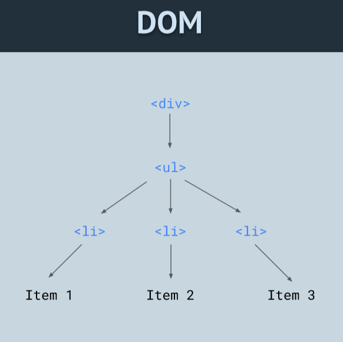
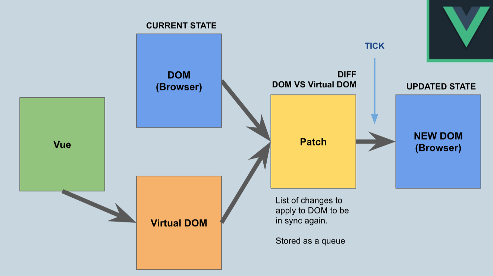
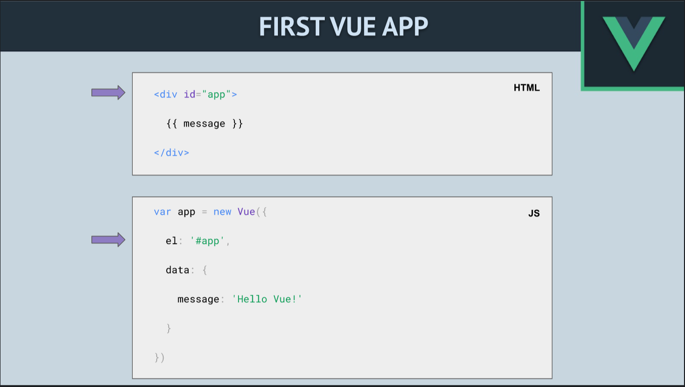

Modul 1 - Introduction

Scrim 1:
Was ist Vue.js?
-> Vue.js ist ein progressives JavaScript Framework.
-> Man kann damit einfach nur eine Komponente in seine Seite einfügen oder auch die komplette Webseite damit bauen.
1. einfach zu verstehen
2. vielseitig
3. effizient, weil nicht so groß und läuft schnell in allen Browsern
4. benutzt die Virtual DOM
5. nimmt nur 20KB Speicher

Aus was besteht das Vue Ecosystem?
--> Add-on Libraries
1. Core: Das erhält man, wenn man Vue installiert. Hier sind noch keine weiteren Bibliotheken installiert.
2. Vuex: Zustandsmanagement
3. Vue Router: Single Page Routing, ohne die Seite neu laden zu müssen
4. Vue CLI: Project Scaffolding with GUI
5. Viele Plugins (Bibliotheken)

Scrim 2:
Was ist das DOM und das Virtual DOM?

1. DOM: Document Object Model --> HTML & XML
2. DOM-Tree: Node Tree Struktur

3. Virtual DOM: Abstraktion von DOM
--> Steht zwischen DOM und Vue
--> Benutzt custom JavaScript Objects, die Elemente repräsentieren
--> Patching: Virtual DOM und DOM sollten immer synchronisiert werden, sonst sieht der User keine Änderungen

DOM Diffing: Patch nimmt die Liste an Änderungen von Vue, die als Queue/Warteschleife gespeichert sind. Dann schaut es, was tatsächlich davon auch in der echten DOM geändert werden muss und ändert dann nur
diese Dinge. Dadurch entsteht eine neue aktualisierte DOM.

Scrim 3:
First Vue App

CDN-Link:  in HTML